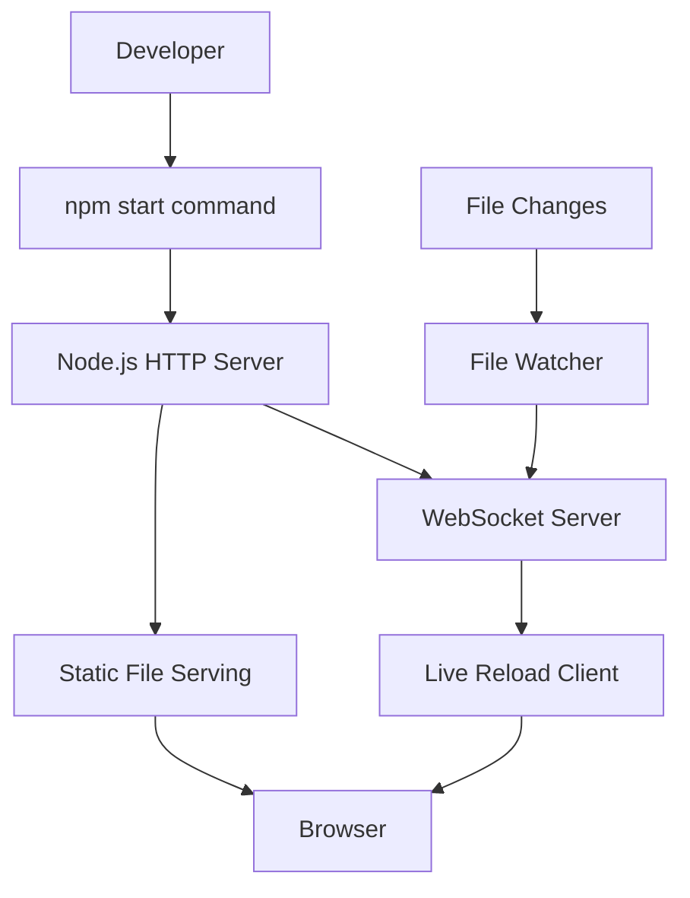

# Design Document

## Overview

The local development server solution will provide a lightweight HTTP server that resolves CORS issues when developing HTML applications locally. The design focuses on simplicity, using Node.js with minimal dependencies to create a development server that serves static files with proper MIME types and includes live reload functionality.

## Architecture

The solution will consist of three main components:

1. **HTTP Server**: A Node.js-based static file server using the built-in `http` module
2. **File Watcher**: A file system watcher that monitors changes and triggers browser reload
3. **Live Reload Client**: Browser-side JavaScript that connects to the server for automatic refresh



## Components and Interfaces

### HTTP Server Component

**Purpose**: Serve static files over HTTP protocol with proper MIME types

**Key Functions**:
- Serve HTML, CSS, JavaScript, JSON, and image files
- Set appropriate Content-Type headers
- Handle 404 errors gracefully
- Support directory listing for development

**Interface**:
```javascript
class DevServer {
  constructor(port, rootDir)
  start()
  stop()
  serveFile(filePath, response)
  getMimeType(filePath)
}
```

### File Watcher Component

**Purpose**: Monitor file system changes and trigger reload events

**Key Functions**:
- Watch specified directories for changes
- Filter relevant file types (html, css, js, json)
- Debounce rapid changes
- Emit reload events

**Interface**:
```javascript
class FileWatcher {
  constructor(watchDir, options)
  start()
  stop()
  on(event, callback)
}
```

### Live Reload Client

**Purpose**: Browser-side component that receives reload signals

**Key Functions**:
- Establish WebSocket connection to server
- Listen for reload messages
- Perform full page reload or CSS-only refresh
- Handle connection errors gracefully

**Interface**:
```javascript
class LiveReloadClient {
  connect(serverUrl)
  onReload(callback)
  onCssChange(callback)
  disconnect()
}
```

## Data Models

### Server Configuration
```javascript
{
  port: number,           // Server port (default: 3000)
  host: string,          // Server host (default: 'localhost')
  rootDir: string,       // Root directory to serve (default: '.')
  watchDirs: string[],   // Directories to watch for changes
  openBrowser: boolean,  // Auto-open browser (default: true)
  liveReload: boolean    // Enable live reload (default: true)
}
```

### File Change Event
```javascript
{
  type: string,          // 'change', 'add', 'unlink'
  path: string,          // File path that changed
  fileType: string,      // 'html', 'css', 'js', 'json'
  timestamp: number      // When the change occurred
}
```

## Error Handling

### Server Startup Errors
- Port already in use: Try alternative ports (3001, 3002, etc.)
- Permission denied: Display clear error message with suggestions
- Missing files: Create basic index.html if none exists

### File Serving Errors
- File not found: Serve custom 404 page with helpful navigation
- Permission errors: Log error and serve 403 response
- Large files: Implement streaming for files over 1MB

### Live Reload Errors
- WebSocket connection failed: Gracefully degrade to manual refresh
- File watcher errors: Log warnings but continue serving files
- Browser compatibility: Provide fallback for older browsers

## Testing Strategy

### Unit Tests
- Test MIME type detection for various file extensions
- Verify file serving functionality with different file types
- Test file watcher event handling and debouncing
- Validate WebSocket message handling

### Integration Tests
- Test complete server startup and shutdown process
- Verify live reload functionality end-to-end
- Test browser auto-opening on different platforms
- Validate CORS resolution with actual browser requests

### Manual Testing
- Test with the existing HTML application
- Verify all resources load without CORS errors
- Test live reload with different file types
- Confirm cross-browser compatibility

### Performance Tests
- Measure server startup time
- Test file serving performance with multiple concurrent requests
- Verify memory usage remains reasonable during development
- Test file watcher performance with large directory structures

## Implementation Notes

### Technology Choices
- **Node.js**: Widely available, good for file serving and WebSocket support
- **Built-in modules**: Use `http`, `fs`, `path` modules to minimize dependencies
- **WebSocket**: For real-time communication between server and browser
- **File watching**: Use Node.js `fs.watch` or `chokidar` for reliable file monitoring

### Development Workflow Integration
- Add npm scripts for easy server management
- Include server setup in project README
- Provide configuration options for different development needs
- Ensure compatibility with existing build processes

### Cross-Platform Considerations
- Handle file path differences between Windows and Unix systems
- Test browser opening on macOS, Windows, and Linux
- Ensure file watching works correctly on all platforms
- Handle different default browsers appropriately